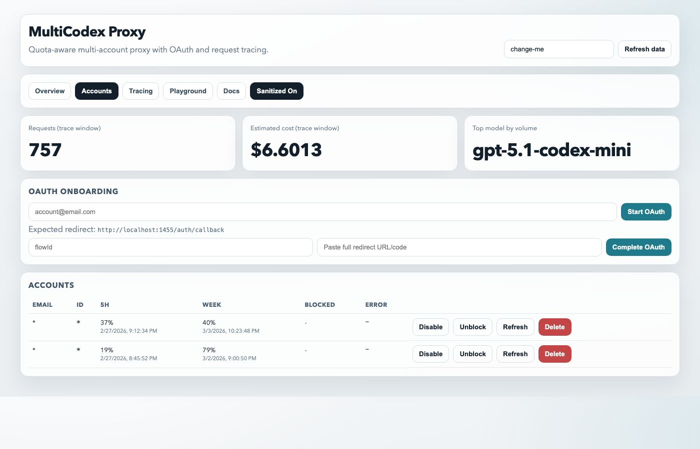
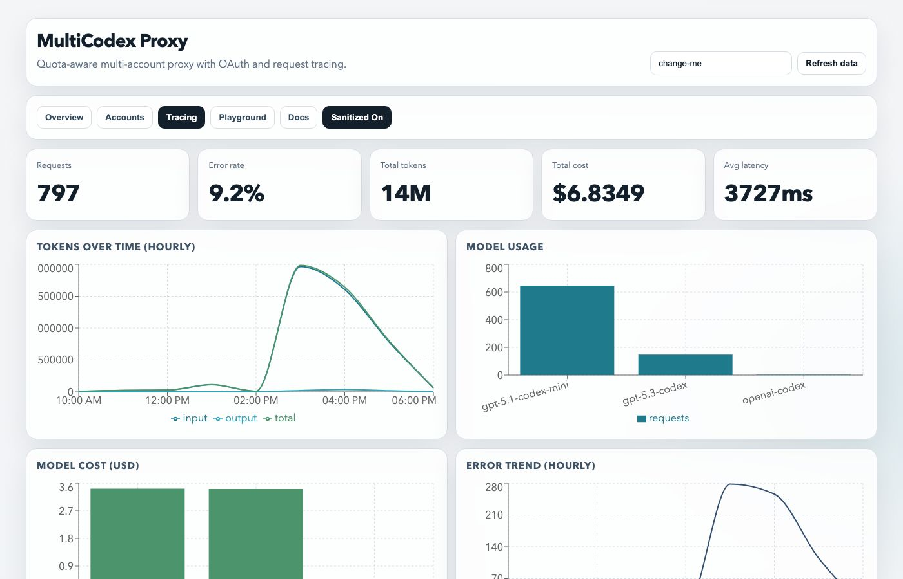
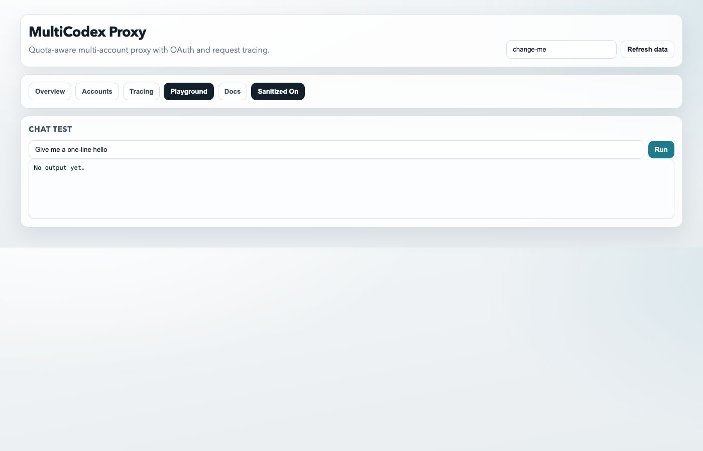

# OpenCodex

<p align="center">
  <strong>OpenAI-compatible multi-provider router</strong><br/>
  <sub>Quota-aware routing • OAuth onboarding • Persistent storage • Request tracing • Automatic model discovery</sub>
</p>

## Codex CLI integration

This package can install a managed Codex launcher set that exposes OpenAI, proxied
remote providers, and local OSS/Ollama models without patching the Codex app
itself.

```bash
npm install -g opencodex
opencodex install
opencodex doctor
```

Installed commands:

- `codex`: default launcher that injects the MultiCodex profile unless you pass
  an explicit profile/provider/local mode.
- `codex-multi`: always uses the MultiCodex proxy profile.
- `codex-oai`: uses the normal OpenAI Codex profile.
- `codex-oss`: uses Codex `--oss` with Ollama by default.
- `opencodex`: setup, auth, sync, update, uninstall, and doctor CLI.
- `codex-multicodex`: compatibility alias for the same CLI.

After `opencodex install`, the proxy starts lazily when `codex` or
`codex-multi` is launched and no proxy is already healthy on the configured
port. It does not install a boot daemon. Runtime account data is stored under
`~/.codex/opencodex/data` by default, not inside the npm tarball.

Useful commands:

```bash
opencodex auth providers
opencodex auth login openrouter --id openrouter --token-env OPENROUTER_API_KEY
opencodex auth import-opencode
opencodex auth import-opencode ~/.local/share/opencode/auth.json --config ./opencode.jsonc
opencodex update
opencodex uninstall
```

<p align="center">
<a href="https://github.com/Ingwannu/opencodex/stargazers"></a>
  <a href="https://github.com/Ingwannu/opencodex/network/members"></a>
  <a href="https://github.com/Ingwannu/opencodex/issues"></a>
</p>

---

## ✨ What it does

OpenCodex acts as an OpenAI-compatible gateway that lets you route requests across multiple provider accounts while keeping a single `/v1` API surface:

- **OpenAI-compatible API**
  - `GET /v1/models`
  - `GET /v1/models/:id`
  - `POST /v1/chat/completions`
  - `POST /v1/responses`
  - `POST /v1/responses/compact`
- **Streaming over SSE or WebSocket**
  - HTTP streaming uses plain `POST` with `stream: true`
  - HTTP response stream is `text/event-stream`
  - `/v1/responses` also accepts `ws://` / `wss://` and Codex-style JSON `response.create` frames
  - `/v1/chat/completions` and `/v1/responses/compact` remain HTTP-only
- **Multi-account routing** with quota-aware failover
- **Model aliases** (for example `small`) with ordered fallback across providers/models
- **OAuth onboarding** from dashboard (manual redirect paste flow)
- **Provider registry** from Models.dev with OpenCode-style provider IDs
- **OpenCode auth import** from `~/.local/share/opencode/auth.json`, including
  custom provider endpoint metadata and provider-level `options.apiKey` /
  `headers.Authorization` secrets from `opencode.json` / `opencode.jsonc`
- **Manual OpenAI-compatible connections** with custom `baseUrl` + API key
- **Persistent account storage** across container restarts
- **Request tracing v2** (retention capped at 1000, server pagination, tokens/model/error/latency stats, optional full payload)
- **Usage stats endpoint** with global + per-account + per-route aggregates over full history
- **Time-range stats** (`sinceMs` / `untilMs`) while keeping only the latest 1000 full traces

---

## 🖼️ Dashboard gallery

> Screenshots below are taken in **sanitized mode** (`?sanitized=1`).

### Overview


### Accounts



### Tracing



### Playground



### API docs tab


---

## 🧠 Routing strategy

When a request arrives, OpenCodex chooses an account with this strategy:

1. Prefer accounts untouched on both windows (5h + weekly)
2. Otherwise prefer account with nearest weekly reset
3. Fallback by priority
4. On `429`/quota-like errors, block account and retry on next

When the requested model is an alias, OpenCodex resolves it to ordered target models and automatically falls back across target models/providers as quotas are hit.

Aliases may also intentionally reuse an already exposed provider model name. In that case, the alias overrides the provider model and routes requests using the alias target order instead.

---

## 📦 Persistence

Everything important is file-based and survives restart (if `/data` is mounted):

- `/data/accounts.json`
- `/data/oauth-state.json`
- `/data/requests-trace.jsonl`
- `/data/requests-stats-history.jsonl`

Trace retention is capped to the latest **1000** entries.
Stats history is append-only and keeps lightweight request metadata for long-term cost/volume tracking.

> Docker compose already mounts `./data:/data`.

---

## 🚀 Quick start (Docker)

```bash
docker compose up -d --build
```

- Dashboard: `http://localhost:1455`
- Health: `http://localhost:1455/health`

---

## 🔐 OAuth onboarding flow

Because this is often deployed remotely (Unraid/VPS), onboarding uses a manual redirect paste flow:

1. Open dashboard
2. For OpenAI accounts, enter the account email
3. Click **Start OAuth**
4. Complete login in browser
5. Copy the full redirect URL shown after the callback completes
6. Paste that URL in the dashboard and click **Complete OAuth**

Mistral and z.ai accounts use manual token entry in the dashboard.
OpenAI-compatible accounts use manual `baseUrl` + API key entry in the dashboard.
The provider selector is populated from Models.dev when network access is
available, then falls back to bundled common providers.

OpenCodex can route providers that map to the current runtime adapters:

- OpenAI ChatGPT OAuth
- OpenAI API through `/v1/responses`
- Mistral
- z.ai
- Anthropic Claude through the native Messages API
- Google Gemini through the native `generateContent` API
- Google Vertex Gemini through the Vertex AI `generateContent` REST API when
  `GOOGLE_VERTEX_PROJECT` / `GOOGLE_VERTEX_LOCATION` or equivalent OpenCode
  provider options are available, and a bearer access token is supplied through
  `GOOGLE_VERTEX_ACCESS_TOKEN`, `GOOGLE_ACCESS_TOKEN`, or provider config secret
- Google Vertex Anthropic through the Vertex AI `rawPredict` REST API under
  `publishers/anthropic` when Vertex project/location routing metadata and a
  bearer access token are available
- Cohere through the native v2 Chat API
- Amazon Bedrock through the native Converse API when
  `AWS_BEARER_TOKEN_BEDROCK`/OpenCode API key credentials and either
  `AWS_REGION`, `AWS_DEFAULT_REGION`, `baseURL`, or provider region metadata are
  available
- OpenAI-compatible providers from Models.dev, including OpenRouter, Requesty,
  local OpenAI-compatible servers, custom OpenCode providers using
  `@ai-sdk/openai-compatible`, and provider SDKs that expose documented
  OpenAI-compatible HTTP endpoints: xAI, Groq, DeepInfra, Cerebras, Together AI,
  Perplexity Sonar, Vercel AI Gateway, v0, Venice, AIHubMix, Merge Gateway, and
  Cloudflare AI Gateway when `CLOUDFLARE_ACCOUNT_ID` and
  `CLOUDFLARE_GATEWAY_ID` or equivalent OpenCode provider options are available
- Azure OpenAI v1 endpoints when `AZURE_RESOURCE_NAME` or an equivalent
  OpenCode `resourceName` / `baseURL` provider option is available; requests use
  Azure's `api-key` header and `/openai/v1` API shape
- GitLab Duo agentic chat models by exchanging `GITLAB_TOKEN`/OpenCode GitLab
  auth for a third-party agent direct-access token, then routing Claude models
  through GitLab's Anthropic AI Gateway proxy and GPT models through GitLab's
  OpenAI AI Gateway proxy
- SAP AI Core Orchestration API by importing `AICORE_SERVICE_KEY` /
  OpenCode SAP service key JSON, exchanging it with OAuth client credentials,
  and calling `/v2/inference/deployments/{deploymentId}/v2/completion`;
  `deploymentId`/`resourceGroup` can come from OpenCode provider options, and
  deployment lookup falls back to the running orchestration deployment list
- OpenCode provider `models` metadata for custom and Models.dev providers, so
  configured models remain visible even when the upstream does not expose an
  OpenAI-style model listing endpoint

Credentials for providers whose native API adapter is not implemented yet, such
as Azure without resource routing metadata, Amazon Bedrock SigV4 access-key
credentials without bearer-token support, Google Vertex ADC/service-account
credential flows without a bearer token, Cloudflare AI Gateway without
account/gateway routing metadata, and other provider-specific SDK adapters, are
imported and shown as auth-only disabled accounts. They are preserved for
management, but are not sent through the proxy until a native adapter or exact
compatibility bridge is added.

Default expected redirect URI:

```text
http://localhost:1455/auth/callback
```

---

## 🧪 API examples

### List models

```bash
curl http://localhost:1455/v1/models
```

Example model object returned:

```json
{
  "id": "gpt-5.3-codex",
  "object": "model",
  "created": 1730000000,
  "owned_by": "opencodex",
  "metadata": {
    "context_window": null,
    "max_output_tokens": null,
    "supports_reasoning": true,
    "supports_tools": true,
    "supported_tool_types": ["function"]
  }
}
```

### Chat completion

```bash
curl -X POST http://localhost:1455/v1/chat/completions \
  -H "content-type: application/json" \
  -d '{
    "model": "gpt-5.3-codex",
    "messages": [{"role":"user","content":"hello"}]
  }'
```

### Streaming responses

```bash
curl -N -X POST http://localhost:1455/v1/responses \
  -H "content-type: application/json" \
  -d '{
    "model": "gpt-5.3-codex",
    "input": "hello",
    "stream": true
  }'
```

### WebSocket responses

```js
const ws = new WebSocket("ws://localhost:1455/v1/responses", {
  headers: {
    Authorization: "Bearer YOUR_TOKEN",
  },
});

ws.onmessage = (event) => {
  console.log(JSON.parse(event.data));
};

ws.onopen = () => {
  ws.send(
    JSON.stringify({
      type: "response.create",
      model: "gpt-5.3-codex",
      input: [
        { role: "user", content: [{ type: "input_text", text: "hello" }] },
      ],
      stream: true,
    }),
  );
};
```

### Create model alias

```bash
curl -X POST http://localhost:1455/admin/model-aliases \
  -H "x-admin-token: change-me" \
  -H "content-type: application/json" \
  -d '{
    "id": "small",
    "targets": ["gpt-5.1-codex-mini", "devstral-small-latest"],
    "enabled": true,
    "description": "Small coding model pool"
  }'
```

### Read traces

```bash
# Paginated API (recommended)
curl -H "x-admin-token: change-me" \
  "http://localhost:1455/admin/traces?page=1&pageSize=100"
```

```bash
# Legacy compatibility mode
curl -H "x-admin-token: change-me" \
  "http://localhost:1455/admin/traces?limit=50"
```

### Usage stats

```bash
curl -H "x-admin-token: change-me" \
  "http://localhost:1455/admin/stats/usage?sinceMs=1735689600000&untilMs=1738291200000"
```

### Trace stats (historical)

```bash
curl -H "x-admin-token: change-me" \
  "http://localhost:1455/admin/stats/traces?sinceMs=1735689600000&untilMs=1738291200000"
```

Optional filters:

- `accountId=<id>`
- `route=/v1/chat/completions`
- `sinceMs=<epoch_ms>`
- `untilMs=<epoch_ms>`

Model alias admin endpoints:

- `GET /admin/model-aliases`
- `POST /admin/model-aliases`
- `PATCH /admin/model-aliases/:id`
- `DELETE /admin/model-aliases/:id`

---

## ⚙️ Environment variables

| Variable                        | Default                                   | Description                                                         |
| ------------------------------- | ----------------------------------------- | ------------------------------------------------------------------- |
| `PORT`                          | `1455`                                    | HTTP server port                                                    |
| `STORE_PATH`                    | `/data/accounts.json`                     | Accounts store                                                      |
| `OAUTH_STATE_PATH`              | `/data/oauth-state.json`                  | OAuth flow state                                                    |
| `TRACE_FILE_PATH`               | `/data/requests-trace.jsonl`              | Request trace file (retained to latest 1000 entries)                |
| `TRACE_STATS_HISTORY_PATH`      | `/data/requests-stats-history.jsonl`      | Lightweight request history for long-term stats                     |
| `TRACE_INCLUDE_BODY`            | `false`                                   | Persist full request payloads when explicitly enabled; trace stats still work when disabled |
| `REQUEST_BODY_LIMIT`            | `100mb`                                   | Max accepted JSON request body size                                 |
| `PROXY_MODELS`                  | Codex + GLM/Kimi/Qwen defaults             | Fallback comma-separated model list for `/v1/models`                |
| `MODELS_CLIENT_VERSION`         | `1.0.0`                                   | Version sent to `/backend-api/codex/models` for model discovery     |
| `MODELS_CACHE_MS`               | `600000`                                  | Model discovery cache duration (ms)                                 |
| `ADMIN_TOKEN`                   | `change-me`                               | Admin endpoints auth token                                          |
| `CHATGPT_BASE_URL`              | `https://chatgpt.com`                     | Upstream base URL                                                   |
| `UPSTREAM_PATH`                 | `/backend-api/codex/responses`            | Upstream request path                                               |
| `UPSTREAM_COMPACT_PATH`         | `/backend-api/codex/responses/compact`    | Upstream path for `/v1/responses/compact`                           |
| `OAUTH_CLIENT_ID`               | `app_EMoamEEZ73f0CkXaXp7hrann`            | OpenAI OAuth client id                                              |
| `OAUTH_AUTHORIZATION_URL`       | `https://auth.openai.com/oauth/authorize` | OAuth authorize endpoint                                            |
| `OAUTH_TOKEN_URL`               | `https://auth.openai.com/oauth/token`     | OAuth token endpoint                                                |
| `OAUTH_SCOPE`                   | `openid profile email offline_access`     | OAuth scope                                                         |
| `OAUTH_REDIRECT_URI`            | `http://localhost:1455/auth/callback`     | Redirect URI                                                        |
| `MISTRAL_COMPACT_UPSTREAM_PATH` | `/v1/responses/compact`                   | Mistral upstream path for compact responses                         |
| `MAX_ACCOUNT_RETRY_ATTEMPTS`    | `10`                                      | Max accounts to try on quota/rate-limit errors                      |
| `MAX_UPSTREAM_RETRIES`          | `5`                                       | Retries per upstream request (429/5xx)                              |
| `UPSTREAM_BASE_DELAY_MS`        | `2000`                                    | Base backoff delay for upstream retries (ms)                        |
| `HANG_RETRY_INTERVAL_MS`        | `10000`                                   | Delay between retry cycles when all accounts are exhausted (ms)     |
| `HANG_RETRY_MAX_DURATION_MS`    | `120000`                                  | Max total time to hang-and-retry before returning 429 to client (ms)|
| `RATE_LIMIT_BLOCK_MS`           | `60000`                                   | Duration to block an account+model after a 429 response (ms)        |

---

## 🛠️ Local dev

```bash
npm install
npm --prefix web install
npm run build
npm run start
```

---

## 📈 Star history

<a href="https://star-history.com/#Ingwannu/opencodex&Date">
  
</a>

---

## 🤝 Contributing

PRs and issues are welcome.

If you open a PR:

- keep it focused
- include before/after behavior
- include screenshots for UI changes
